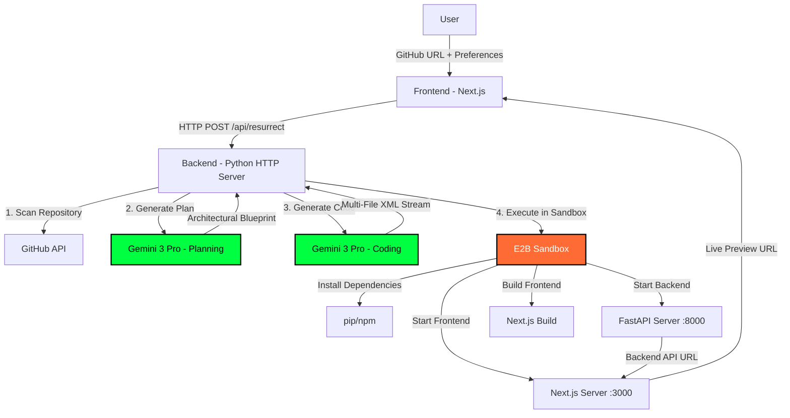

# 🧬 Lazarus Engine - Autonomous Code Resurrection System

<div align="center">


**Bring legacy code back to life with AI-powered modernization**

[Features](#-features) • [Architecture](#-architecture) • [Setup](#-setup) • [Usage](#-usage) • [Tech Stack](#-tech-stack)

</div>

---

## 📖 Overview

**Lazarus Engine** is an autonomous AI-powered system that resurrects legacy codebases by analyzing, modernizing, and deploying them as production-ready full-stack applications. It leverages Google's Gemini 3 Pro AI model and E2B sandboxed execution environments to transform outdated code into modern, scalable applications with zero manual intervention.

### 🎯 What It Does

1. **Scans** legacy GitHub repositories
2. **Analyzes** code architecture and API contracts
3. **Generates** modern full-stack applications (FastAPI + Next.js)
4. **Deploys** to isolated E2B sandboxes with live preview URLs
5. **Auto-heals** build errors and syntax issues
6. **Adapts** to user preferences (design, features, tech stack)

---

## ✨ Features

### 🤖 AI-Powered Intelligence
- **Gemini 3 Pro Integration**: Uses Google's latest AI model for code generation
- **Chain-of-Thought Reasoning**: Plans architecture before coding
- **Preference Analysis**: Extracts design preferences, features, and tech stack from natural language
- **Auto-Healing**: Automatically detects and fixes TypeScript/Python syntax errors

### 🏗️ Full-Stack Generation
- **Backend**: FastAPI with automatic CORS, Pydantic validation, JWT auth
- **Frontend**: Next.js 15 (App Router) with TypeScript and Tailwind CSS
- **Design System**: Cyberpunk glassmorphism aesthetic with custom color schemes
- **Production-Ready**: Includes error handling, loading states, and responsive design

### 🔒 Sandboxed Execution
- **E2B Cloud Sandboxes**: Isolated execution environments (30-minute sessions)
- **Dual-Stack Deployment**: Concurrent backend and frontend servers
- **Live Preview URLs**: Instant access to running applications
- **Dependency Management**: Automatic Python/Node.js package installation

### 🔄 Auto-Retry & Resilience
- **Build Error Detection**: Parses compilation errors and regenerates code
- **API Rate Limiting**: Exponential backoff for Gemini API (429/500/503 errors)
- **Health Checks**: Verbose logging and 60-second backend boot verification
- **Sandbox Cleanup**: Aggressive termination of stale environments

---

## 🏛️ Architecture



### 🔄 Execution Flow

1. **Initialization**
   - User provides GitHub repository URL and preferences
   - Frontend sends resurrection request to backend

2. **Planning Phase** (Gemini 3 Pro)
   - Scans repository structure via GitHub API
   - Analyzes user preferences (design, features, tech stack)
   - Generates architectural plan with API contracts

3. **Code Generation** (Gemini 3 Pro)
   - Implements plan as multi-file XML stream
   - Generates backend (FastAPI), frontend (Next.js), configs
   - Includes CORS, validation, error handling, styling

4. **Sandbox Deployment** (E2B)
   - Creates isolated cloud environment
   - Installs Python dependencies (AST-based inference)
   - Starts FastAPI backend on port 8000
   - Installs Node.js dependencies (`npm install --force`)
   - Builds Next.js frontend (`npm run build`)
   - Starts production server on port 3000

5. **Auto-Healing** (Optional)
   - Detects build failures (TypeScript errors, etc.)
   - Regenerates code with error context
   - Retries up to 2 times automatically

6. **Result**
   - Returns live preview URL to frontend
   - User can interact with resurrected application
   - 30-minute sandbox session with countdown timer

---

## 🛠️ Tech Stack

### Backend
| Technology | Purpose | Version |
|------------|---------|---------|
| **Python** | Core language | 3.9+ |
| **FastAPI** | Generated backend framework | Latest |
| **Gemini 3 Pro** | AI code generation | `gemini-3-pro-preview` |
| **E2B SDK** | Sandbox execution | `e2b-code-interpreter` |
| **Pydantic** | Data validation | Latest |
| **Requests** | HTTP client | Latest |

### Frontend
| Technology | Purpose | Version |
|------------|---------|---------|
| **Next.js** | React framework | 15.0.0 |
| **React** | UI library | 19.x |
| **TypeScript** | Type safety | Latest |
| **Tailwind CSS** | Styling | Latest |
| **Lucide React** | Icons | Latest |

### Infrastructure
| Technology | Purpose |
|------------|---------|
| **E2B Cloud Sandboxes** | Isolated execution environments |
| **GitHub API** | Repository scanning |
| **NDJSON Streaming** | Real-time log updates |

---

## 🚀 Setup

### Prerequisites

- **Python 3.9+**
- **Node.js 18+** and npm
- **Git**
- **API Keys**:
  - [Google AI Studio](https://aistudio.google.com/) - Gemini API Key
  - [E2B](https://e2b.dev/) - E2B API Key
  - [GitHub](https://github.com/settings/tokens) - Personal Access Token (optional, for private repos)

### Installation

1. **Clone the repository**
   ```bash
   git clone https://github.com/ArunN2005/lazarus-hackathon.git
   cd lazarus-hackathon
   ```

2. **Backend Setup**
   ```bash
   cd backend
   pip install -r requirements.txt
   ```

3. **Configure Environment Variables**
   
   Create `backend/.env`:
   ```env
   GEMINI_API_KEY=your_gemini_api_key_here
   E2B_API_KEY=your_e2b_api_key_here
   GITHUB_TOKEN=your_github_token_here  # Optional
   ```

4. **Frontend Setup**
   ```bash
   cd ../frontend
   npm install
   ```

5. **Run the Application**
   
   From the root directory:
   ```powershell
   # Windows
   ./run.ps1
   ```
   
   Or manually:
   ```bash
   # Terminal 1 - Backend
   cd backend
   python main.py
   
   # Terminal 2 - Frontend
   cd frontend
   npm run dev
   ```

6. **Access the Application**
   - Frontend: http://localhost:3000
   - Backend API: http://localhost:8000

---

## 📚 Usage

### Basic Resurrection

1. **Open the frontend** at http://localhost:3000
2. **Enter a GitHub repository URL**
   - Example: `https://github.com/username/legacy-project`
3. **Add preferences** (optional)
   - Design: "Dark blue theme with gold accents"
   - Features: "Add user authentication and dashboard"
   - Style: "Minimalist design with charts"
4. **Click "Resurrect"**
5. **Wait for processing** (~2-5 minutes)
   - Watch real-time logs in the UI
   - See planning, code generation, and deployment phases
6. **Access the live preview**
   - Click the preview URL when ready
   - Interact with your modernized application

### Advanced Preferences

The AI understands natural language preferences:

**Design Preferences**:
- "Cyberpunk aesthetic with neon green accents"
- "Corporate professional theme in navy blue"
- "Pastel colors with soft shadows"

**Feature Requests**:
- "Add real-time chat functionality"
- "Include data visualization with charts"
- "Implement e-commerce product catalog"

**Tech Stack**:
- "Use PostgreSQL instead of SQLite"
- "Add Redis caching layer"
- "Include WebSocket support"

---

## 🔧 Configuration

### Backend Configuration

**`backend/lazarus_agent.py`** - Core engine settings:
```python
# AI Models
self.planner_model = "gemini-3-flash-preview"  # Fast planning
self.coder_model = "gemini-3-pro-preview"      # High-quality code

# Sandbox Settings
timeout=1800  # 30 minutes

# Retry Settings
max_retries = 2  # Auto-healing attempts
```

### Frontend Configuration

**`frontend/app/page.tsx`** - UI settings:
```typescript
const [timeLeft, setTimeLeft] = useState<number | null>(null);
// Timer starts at 1800 seconds (30 minutes)
```

---

## 🧪 Testing

### Manual Testing

1. **Test with a simple repository**:
   ```
   https://github.com/your-username/simple-flask-app
   ```

2. **Test with preferences**:
   ```
   Repository: https://github.com/example/legacy-app
   Preferences: "Modern dark theme with authentication"
   ```

3. **Verify outputs**:
   - Check backend logs for health checks
   - Confirm frontend builds successfully
   - Test live preview URL functionality

### Debug Mode

Enable verbose logging in `backend/lazarus_agent.py`:
```python
print(f"[DEBUG] Sandbox Output:\n{sandbox_logs}")
```

---

## 📁 Project Structure

```
lazarus-hackathon/
├── backend/
│   ├── main.py                 # HTTP server entry point
│   ├── lazarus_agent.py        # Core AI engine
│   ├── simple_env.py           # Environment loader
│   ├── requirements.txt        # Python dependencies
│   └── .env                    # API keys (not in git)
├── frontend/
│   ├── app/
│   │   ├── layout.tsx          # Root layout
│   │   ├── page.tsx            # Main UI
│   │   └── globals.css         # Global styles
│   ├── package.json            # Node dependencies
│   └── tailwind.config.ts      # Tailwind configuration
├── run.ps1                     # Windows startup script
└── README.md                   # This file
```

---

## 🎨 Design Philosophy

### Cyberpunk Glassmorphism
- **Background**: Deep black (`#000000`)
- **Cards**: Semi-transparent black with backdrop blur
- **Borders**: White with 10% opacity
- **Gradients**: Cyan to purple (`from-cyan-400 to-purple-600`)
- **Typography**: Bold, futuristic headings

### Code Quality Principles
1. **Production-Ready**: No placeholders or TODOs
2. **Type Safety**: TypeScript interfaces, Pydantic models
3. **Error Handling**: Try-catch blocks, loading states
4. **Responsive**: Mobile-first design
5. **Accessible**: Semantic HTML, ARIA labels

---

## 🐛 Troubleshooting

### Backend Won't Start
```bash
# Check Python version
python --version  # Should be 3.9+

# Verify dependencies
pip install -r backend/requirements.txt

# Check API keys
cat backend/.env
```

### Frontend Build Errors
```bash
# Clear cache
cd frontend
rm -rf .next node_modules
npm install --force
npm run dev
```

### Sandbox Connection Issues
- **Check E2B Dashboard**: Verify sandbox is running
- **Review Logs**: Look for health check failures
- **Increase Timeout**: Edit `timeout=1800` in `lazarus_agent.py`

### TypeScript Errors in Generated Code
- The auto-healing system should fix these automatically
- If not, check logs for retry attempts
- Verify TypeScript syntax rules in prompt

---

## 🤝 Contributing

Contributions are welcome! Please follow these guidelines:

1. Fork the repository
2. Create a feature branch (`git checkout -b feature/amazing-feature`)
3. Commit your changes (`git commit -m 'Add amazing feature'`)
4. Push to the branch (`git push origin feature/amazing-feature`)
5. Open a Pull Request

---

## 📄 License

This project is licensed under the MIT License - see the [LICENSE](LICENSE) file for details.

---

## 🙏 Acknowledgments

- **Google Gemini Team** - For the incredible AI models
- **E2B Team** - For sandboxed execution infrastructure
- **Vercel** - For Next.js framework
- **FastAPI Team** - For the modern Python web framework

---

## 📞 Contact

**Arun N**
- GitHub: [@ArunN2005](https://github.com/ArunN2005)
- Project Link: [https://github.com/ArunN2005/lazarus-hackathon](https://github.com/ArunN2005/lazarus-hackathon)

---

<div align="center">

**Built with ❤️ for the Lazarus Hackathon**

*Bringing legacy code back to life, one repository at a time.*

</div>
